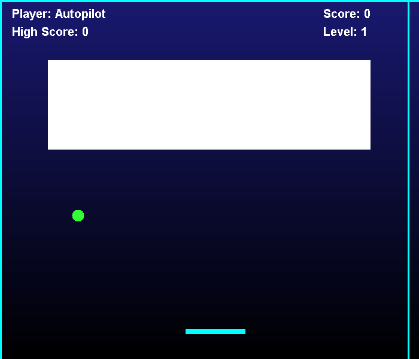
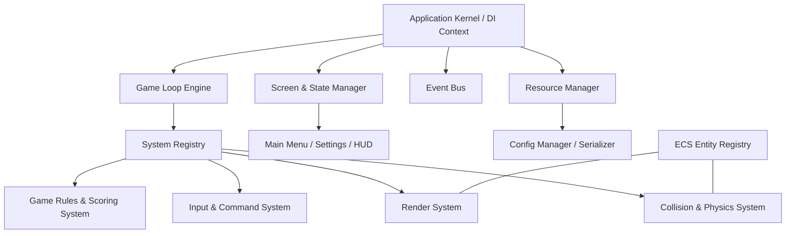

# Brick Breaker Deluxe 2.0

[](https://openjdk.org/)
[](https://maven.apache.org/)
[](LICENSE)
[](#system-architecture)

An extensible, high-performance 2D arcade game engine built in Java. This project represents the evolution of a monolithic Swing desktop application into a modern, decoupled, and highly optimized game engine incorporating Clean Architecture, design patterns, and systems optimization techniques.

---

## Live Web Demonstration

An interactive, browser-compatible version of the game frontend is available online: 

[brickbreakerfrontend.vercel.app](https://brickbreakerfrontend.vercel.app/)

---

## Gameplay Screenshot



---

## System Architecture

The core engine is structured using a Modular Layered Architecture with a custom Entity-Component-System (ECS) pattern, coordinated by a Service Locator for clean dependency injection and lifecycle decoupling.



### Key Architectural Pillars:
1. **Custom Entity-Component-System (ECS)**: Decouples component data from operational systems logic. Entities are represented as unique numerical IDs, avoiding deep OOP inheritance trees and resolving the fragile base class problem.
2. **Fixed-Timestep Game Loop Thread**: Operates independently of AWT's Event Dispatch Thread (EDT). Decouples physics updates (locked at 60Hz) from rendering frame pacing to ensure uniform gameplay physics across different CPU configurations.
3. **Service Locator Container**: Manages dynamic registry injection of core services including the Event Bus, ECS Registry, and Input Manager.
4. **Publish-Subscribe Event Bus**: An observer pattern implementation that eliminates class coupling. Subsystems register for and publish concrete record structures (e.g., `BrickBrokenEvent`).
5. **Active Rendering Canvas**: Employs double-buffered frame buffers and `BufferStrategy` directly on a focusable AWT Canvas, bypassing Swing repaint queue delays.
6. **Command Pattern Input Router**: Decouples keys from coordinate alteration. The `InputManager` maps keystrokes to executable commands, enabling dynamic input configuration.

---

## Operational Features

* **Config-driven Game Properties**: Operational dimensions, speeds, boundaries, and scores file paths are externalized inside [game_config.json](src/main/resources/assets/configs/game_config.json).
* **Polymorphic Brick Types**: Additional brick variants (e.g., explosive, laser, gravity) are added by registering components to entities, without modifying existing physics logic.
* **Structured Diagnostics Telemetry**: Integrates Log4j2 console logging and a debug HUD overlay tracing real-time rendering statistics.
* **Zero-Allocation Memory Safety**: Employs reusable object pools to recycle bounding rectangles, vectors, and particle instances, preventing JVM Garbage Collection micro-stutters during play.

---

## Getting Started

### Prerequisites
* Java Development Kit (JDK) 17 or higher
* Maven (or execution via the local tools bundle)

### Compilation and Build
To clean compilation artifacts and package the game into a self-contained, executable JAR:
```bash
# Using Maven globally
mvn clean package

# Or using the local bundle
.\tools\apache-maven-3.9.6\bin\mvn clean package
```

### Execution
Run the game using either target execution tool:
```bash
# Run compiling classes directly
.\tools\apache-maven-3.9.6\bin\mvn exec:java

# Run the packaged executable JAR
java -jar target/brickbreaker-2.0.0.jar
```

---

## Configuration Specifications

Properties inside the configuration files can be adjusted dynamically:

* **File Location**: `src/main/resources/assets/configs/game_config.json`
* **Custom Variables**:
  * Modify `window.width` and `window.height` to adjust the game screen resolution.
  * Adjust `paddle.speed` and `ball.speedX`/`ball.speedY` to change the game velocity.

---

## Verification and Testing

The engine includes validation setups for game logic and physics simulation checks:
```bash
# Run unit and integration tests
.\tools\apache-maven-3.9.6\bin\mvn test
```

---

## License
This project is open-source and available under the [MIT License](LICENSE).
