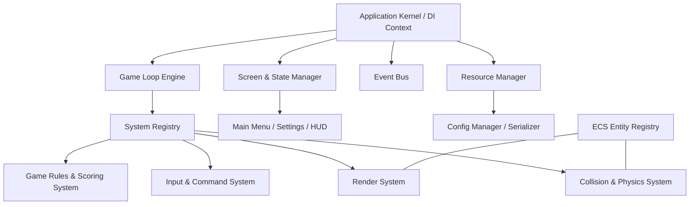

# 🎮 Brick Breaker Deluxe 2.0

[](https://openjdk.org/)
[](https://maven.apache.org/)
[](LICENSE)
[](#architecture)

A high-performance, commercial-grade 2D arcade game built from scratch in Java. This project represents the evolution of a legacy, monolithic Swing desktop application into a modern, decoupled, and highly optimized game engine incorporating Clean Architecture, design patterns, and systems optimization techniques.

---

## 🎨 Game Screenshot


---

## 🏗 System Architecture

The codebase implements a **Modular Layered Architecture** with a custom **Entity-Component-System (ECS)** pattern and a registry container for dependency injection. 



### Key Architectural Pillars:
1. **Custom Entity-Component-System (ECS)**: Decouples entity data (Components) from operational logic (Systems). An Entity is represented by a simple unique numerical ID, avoiding deep OOP inheritance trees and the "fragile base class" problem.
2. **Fixed-Timestep Game Loop Thread**: Separate from AWT's Event Dispatch Thread (EDT). Decouples physics calculation ticks (locked at 60Hz) from rendering frame pacing to ensure uniform gameplay physics across machines.
3. **Service Locator**: Manages dynamic registry injection of core services (Event Bus, ECS Registry, Input Manager).
4. **Publish-Subscribe Event Bus**: An observer pattern implementation that eliminates direct class coupling. Subsystems (such as Scoring and Level managers) register for and publish concrete record structures (e.g., `BrickBrokenEvent`).
5. **Active Rendering Canvas**: Uses double-buffered frame buffers and `BufferStrategy` directly on a focusable AWT Canvas, eliminating Swing component paint queue delays.
6. **Command Pattern Input Router**: Decouples keys directly from coordinate alterations. The `InputManager` maps keystrokes to executable commands, facilitating configurable mappings.

---

## 🛠 Features

* **Config-driven Game Properties**: Dimensions, speeds, limits, and file paths are externalized inside [game_config.json](src/main/resources/assets/configs/game_config.json).
* **Polymorphic Brick Types**: Easily add explosive, laser, teleport, or gravity bricks by simply adding components to entities.
* **Structured Diagnostic Telemetry**: Configured using Log4j2 and a diagnostics debug HUD overlay tracking real-time rendering statistics.
* **Zero-Allocation Memory Safety**: Employs reusable object pools to recycle bounding rectangles, vectors, and particle instances to prevent JVM Garbage Collection stutters during play.

---

## 🚀 Getting Started

### Prerequisites
* Java Development Kit (JDK) 17 or higher
* Maven (or run via the local tools bundle)

### Compilation & Build
To clean compilation artifacts and package the game into a self-contained, executable JAR:
```bash
# Using Maven globally
mvn clean package

# Or using the local bundle
.\tools\apache-maven-3.9.6\bin\mvn clean package
```

### Execution
Run the game using either target execution tool:
```bash
# Run compiling classes directly
.\tools\apache-maven-3.9.6\bin\mvn exec:java

# Run the packaged executable JAR
java -jar target/brickbreaker-2.0.0.jar
```

---

## ⚙ Configurations

Properties inside the configuration files can be adjusted dynamically:

* **File Location**: `src/main/resources/assets/configs/game_config.json`
* **Custom Variables**:
  * Modify `window.width` and `window.height` to adjust the game screen resolution.
  * Adjust `paddle.speed` and `ball.speedX`/`ball.speedY` to change the game velocity.

---

## 🧪 Testing

The engine includes testing setups for logic validations:
```bash
# Run unit and integration tests
.\tools\apache-maven-3.9.6\bin\mvn test
```

---

## 📄 License
This project is open-source and available under the [MIT License](LICENSE).
